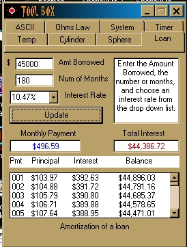



## ToolBox

### Description

A simple application with 8 selectable utilities:

Temperature; Loan Amortization; System; Ohms Law; ASCII; Timer; Volume calculations
 
### More Info
 
Built with VB6 Pro. Don't know how or if the project will work under any other release. Project should be extracted into "C:\Utility"

path.

Not real well documented, but is completely functional.

             |
---                |---
**Submitted On**   |2001-01-01 16:22:30
**By**             |[M Allen](https://github.com/Planet-Source-Code/PSCIndex/blob/master/ByAuthor/m-allen.md)
**Level**          |Beginner
**User Rating**    |4.2 (21 globes from 5 users)
**Compatibility**  |VB 6\.0
**Category**       |[Complete Applications](https://github.com/Planet-Source-Code/PSCIndex/blob/master/ByCategory/complete-applications__1-27.md)
**World**          |[Visual Basic](https://github.com/Planet-Source-Code/PSCIndex/blob/master/ByWorld/visual-basic.md)
**Archive File**   |[CODE\_UPLOAD13258112001\.zip](https://github.com/Planet-Source-Code/m-allen-toolbox__1-14022/archive/master.zip)

### API Declarations

GlobalMemoryStatus

